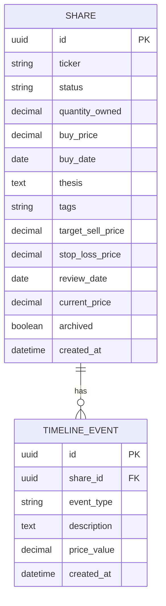

# InvTrack — MVP1 data model (ERD)

Two entities cover MVP1 scope: current state lives on `SHARE`, history lives on `TIMELINE_EVENT`. `current_price` on `SHARE` is denormalized from the latest price-type `TIMELINE_EVENT`, kept in sync on write, so the dashboard doesn't need to join on every read.

`tags` is a plain string, not a normalized join table — deliberate for MVP1 since tags are free-text with no fixed taxonomy (see PRD, US-3.1). Revisit if MVP2 needs tag-based filtering/analytics.

## Notes

- `status` values: `watching`, `waiting_to_buy`, `holding`, `waiting_to_buy_more`, `waiting_to_sell`, `sold`.
- `archived` is independent of `status` — a `sold` share can be archived or not; archiving only affects default dashboard visibility (see PRD, US-1.3).
- `event_type` values on `TIMELINE_EVENT`: `created`, `price_update`, `status_change`, `edit`, `sold`. `price_value` is only populated for `price_update` events.
